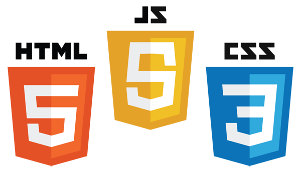
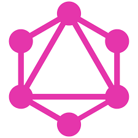

# Online Store

> This project showcases a Full stack online store application with React.js and GraphQL.

## Built With

* [GraphQL](https://graphql.org/) - The API query language used
* [Next.js](https://graphql.org/) - The React Framework used
* [HTML](https://en.wikipedia.org/wiki/HTML) - The markup language used
* [CSS](https://en.wikipedia.org/wiki/Cascading_Style_Sheets) - The style sheet language used
* [Javascript](https://en.wikipedia.org/wiki/JavaScript) - The programming language used
* [Node.js®](https://nodejs.org/) - The JavaScript runtime used
* [Webpack](https://webpack.js.org/) - The build tool used

## Authors

* **[Pemberai Sweto](https://github.com/thepembeweb)** - *Initial work* - [Online Store](https://github.com/thepembeweb/online-store)

## License

- This project is licensed under the MIT License - see the [LICENSE.md](LICENSE.md) file for details
- Copyright 2021 © [Pemberai Sweto](https://github.com/thepembeweb).

